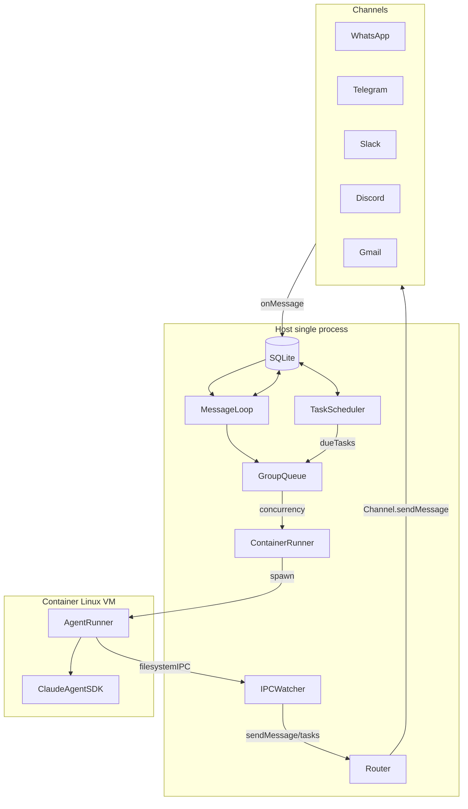

# NanoClaw 项目深度分析报告

基于 [nanoclaw](https://github.com/qwibitai/nanoclaw) 仓库文档与代码的调研，按五个维度整理：核心问题与用户、核心模块与工作流、整体架构、技术选型对比、安全优缺点。

---

## 1. 核心问题、目标用户与近期重要更新

### 1.1 核心要解决什么问题？

NanoClaw 针对的是「**个人 Claude 助手既要好用，又要安全、可理解、可定制**」的矛盾：

- **安全与可理解**：对标 [OpenClaw](https://github.com/openclaw/openclaw) 的「大而难审计」——用**容器级隔离 + 显式挂载**替代应用层白名单/配对码，代码量控制在「一个人能读完、敢改」的规模。
- **个人定制**：面向**单用户**，按需选渠道和功能；通过 fork + skills 得到「只做自己需要的事」的代码，而不是一个支持所有场景的臃肿系统。
- **无配置膨胀**：不依赖大量配置文件；行为差异通过**改代码**或 skills 实现，核心保持极简。
- **可扩展但不膨胀**：新能力（新渠道、新集成）通过 **Claude Code skills** 以「合并进代码库」的方式添加，而不是在主仓库里无限堆 feature。

### 1.2 目标用户是谁？

- **个人用户**：希望有一个自己完全理解、可定制的「个人 Claude 助手」，能通过常用 IM/邮件联系，跑在自家机器或单机上。
- **愿意改代码/Fork 的用户**：接受「定制 = 改代码」，并会用 Claude Code 执行 `/setup`、`/add-whatsapp` 等技能来改自己的 fork。
- **重视安全与隔离的用户**：在意智能体只接触显式挂载的目录、凭证不落盘到容器内、非主群组权限受限等（见 [docs/SECURITY.md](SECURITY.md)）。
- **不追求企业级多租户**：文档明确是「单用户、单进程」，适合个人或小团队自用，而非多租户 SaaS。

### 1.3 近期最重要的三个更新（基于 CHANGELOG 与 package.json）

当前 [CHANGELOG.md](../CHANGELOG.md) 只维护到 **1.2.0**，[package.json](../package.json) 版本为 **1.2.12**。以下以 CHANGELOG 已记录内容为准；1.2.1–1.2.12 的变更需从 git 历史或 release notes 补全。

1. **[1.2.0] WhatsApp 从核心移除，改为 skill（破坏性变更）**
  需在已有安装上执行 `/add-whatsapp` 才能继续使用 WhatsApp；已有认证与群组会保留。体现「技能优于功能」、核心持续瘦身的策略。
2. **[1.2.0] 计划任务重复执行问题修复**
  当容器运行时间超过轮询间隔时，防止同一计划任务被触发两次（#138, #669）。
3. **CHANGELOG 与版本不同步**
  当前 CHANGELOG 仅到 1.2.0，更早或更近的「重要更新」需从 git 历史或 release notes 获取；分析以已有条目为准。

---

## 2. 核心模块的功能与工作流程（通俗解释）

下面用「现实世界在干什么」的方式描述一条典型链路，并指出关键模块与职责。

### 整体链路（一句话）

**IM/邮件渠道收到消息 → 写入 SQLite → Host 轮询 → 按群组排队 → 在容器里跑 Claude Agent → 结果通过渠道发回用户。**

### 分步说明

1. **渠道收到消息**
  各渠道（WhatsApp、Telegram、Slack、Discord、Gmail 等）由 skills 添加，在 `src/channels/` 下实现并自注册。消息到达后，渠道把「谁发的、在哪个群、内容是什么」写入 **SQLite**（`store/messages.db`），由 `src/db.ts` 负责存取。
2. **Host 轮询与路由**
  主进程（`src/index.ts`）里有一个**消息循环**，每隔一段时间（如 2 秒）查 SQLite 的「新消息」。  
   **Router**（`src/router.ts`）负责：  
  - 判断这条消息是否来自已注册群组；  
  - 是否带触发词（如 `@Andy`）；  
  - 把该群组「自上次 Agent 回复以来的所有消息」拼成一段带时间戳和发送者的对话文本，作为发给 Claude 的 prompt。
3. **群组队列与并发控制**
  不是每条消息都立刻起一个容器。**GroupQueue**（`src/group-queue.ts`）按群组排队，并限制**全局同时运行的容器数量**（如 5 个）。  
   轮到某个群组时，会调用 `processGroupMessages(chatJid)`：拉取该群未处理消息、格式化、调用 `runAgent()`。
4. **跑 Agent：容器与 IPC**
  **Container Runner**（`src/container-runner.ts`）负责：  
  - 按群组挂载对应目录（`groups/{name}/`、会话目录、IPC 目录等）；  
  - 启动容器，把 prompt、sessionId、群组信息等通过 stdin 传给容器内的 **Agent Runner**。  
   容器内（`container/agent-runner/src/index.ts`）：  
  - 用 **Claude Agent SDK** 跑对话；  
  - 通过**文件系统 IPC**（写 JSON 文件到 `/workspace/ipc/`）向 Host 请求「发消息」「建计划任务」等；  
  - 流式输出用 `OUTPUT_START_MARKER` / `OUTPUT_END_MARKER` 包起来，Host 解析后把正文发给用户。
5. **计划任务**
  **Task Scheduler**（`src/task-scheduler.ts`）在 Host 上单独循环，按 SQLite 里存的计划（cron/interval/once）在到期时往对应群组「塞任务」；任务同样通过 GroupQueue 进容器执行，和普通消息共用同一套 `runAgent` 路径。
6. **IPC 回写与权限**
  **IPC Watcher**（`src/ipc.ts`）轮询 `data/ipc/{group}/messages/` 和 `tasks/` 下的 JSON 文件。  
   容器内 Agent 通过 MCP 工具调用「发消息」「建/改/删计划任务」时，会写成这些文件；Host 根据**群组身份**做鉴权（例如非主群组不能给其他群组发消息或代其建任务），再调用 Router 发消息或写 DB。

### 关键模块与职责小结

| 模块/文件                                   | 主要职责                                                                     |
| --------------------------------------- | ------------------------------------------------------------------------ |
| `src/index.ts`                          | 编排器：加载状态、连接渠道、启动消息轮询与调度循环、调用 `processGroupMessages` 与 `runAgent`。        |
| `src/channels/registry.ts` + `index.ts` | 渠道工厂注册表；各渠道在加载时自注册，编排器只连接「有凭据」的渠道。                                       |
| `src/db.ts`                             | SQLite：消息、群组、会话、计划任务、路由状态。                                               |
| `src/router.ts`                         | 消息格式化（`formatMessages`）、出站路由（`findChannel`、`routeOutbound`）。             |
| `src/group-queue.ts`                    | 按群组排队、全局并发限制、容器生命周期（启动/复用/关闭 stdin）。                                     |
| `src/container-runner.ts`               | 构建挂载参数、生成容器启动命令、与容器 stdin/stdout 通信、解析 Agent 输出。                         |
| `src/task-scheduler.ts`                 | 定时检查到期任务、把任务交给 GroupQueue 执行。                                            |
| `src/ipc.ts`                            | 轮询 IPC 目录、处理「发消息」「注册群组」「计划任务」等来自容器内的请求并鉴权。                               |
| `container/agent-runner/src/index.ts`   | 容器内入口：读 stdin 得到初始 prompt、轮询 IPC 输入、调用 Claude Agent SDK、把结果写 stdout/IPC。 |

---

## 3. 整体架构模式与模块组织

### 3.1 属于哪种典型架构模式？

NanoClaw 是**单进程编排 + 容器沙箱 + 技能式扩展**的组合：

- **单进程**：一个 Node.js 进程完成渠道连接、轮询、队列、调度、IPC，无微服务、无独立消息队列。
- **容器沙箱**：所有 Agent 执行都在独立 Linux 容器（macOS 上可用 Apple Container 或 Docker）内，通过挂载和 IPC 与 Host 通信。
- **技能式扩展**：新渠道、新集成通过 Claude Code skills（如 `/add-telegram`）以「改代码 + 合并」的方式加入，而不是运行时插件 API。

因此可以概括为：**单体应用 + 进程级隔离的执行层 + 基于代码合并的扩展机制**。

### 3.2 模块之间如何组织？

- **Host（控制面）**：`src/` 下——编排、路由、DB、队列、调度、IPC、凭证代理、挂载校验；渠道在 `src/channels/` 自注册，由 `index.ts` 在启动时拉取并连接。
- **Container（执行面）**：`container/` 下——镜像构建（Dockerfile、build.sh）、容器内入口与 IPC（agent-runner），不直接依赖 Host 源码，只依赖约定好的 stdin/stdout 和文件 IPC 协议。
- **扩展**：`.claude/skills/` 下按技能分目录，每个技能通过 SKILL.md 指导 Claude Code 修改代码库（包括 `src/channels/index.ts` 的 import、manifest 等）；核心不内置所有渠道，由用户按需 apply skill。
- **配置与状态**：`groups/`（群组目录与 CLAUDE.md）、`store/`（DB、认证）、`data/`（会话、IPC）、`logs/`；配置常量在 `src/config.ts`，无大量独立配置文件。

### 3.3 架构图（Mermaid）

---

## 4. 技术选型对比：NanoClaw vs CoPaw / KimiClaw / ZeroClaw

你关心的场景是：**CoPaw / Kimi Claw 适合办公生态，ZeroClaw 适合生产环境/极限资源部署**。下面从成熟度、社区、性能、学习曲线、维护性五个维度做对比，并给出场景建议。

### 4.1 四个项目简要定位

| 项目           | 定位简述                                                                         |
| ------------ | ---------------------------------------------------------------------------- |
| **NanoClaw** | 单用户、小代码库、容器隔离、skills 扩展；对标 OpenClaw 的「可审计、可定制」替代方案。                          |
| **CoPaw**    | 阿里 AgentScope 团队出品，Python、本地优先；强调中文办公生态（钉钉、飞书、QQ 等）、多模型与 MCP/ClawHub skills。 |
| **KimiClaw** | 月之暗面（Kimi）的云托管方案，零部署、浏览器即用；Kimi K2.5、大量技能与云端 RAG，订阅制（约 ¥199/月）。              |
| **ZeroClaw** | 极简、Rust、超低资源占用（约 3.4MB 内存、5ms 级启动）；面向边缘/嵌入式/生产环境极致资源约束。                      |

### 4.2 五维度对比

| 维度        | NanoClaw                                          | CoPaw                                   | KimiClaw                  | ZeroClaw                       |
| --------- | ------------------------------------------------- | --------------------------------------- | ------------------------- | ------------------------------ |
| **成熟度**   | 单仓库、单进程，代码量小、易审计；CHANGELOG 仅到 1.2.0，实际版本已到 1.2.x。 | 阿里背书、AgentScope 生态，成熟度较高。               | 商业云产品，功能成熟，依赖厂商。          | 新兴、偏极客/实验，生态较薄。                |
| **社区与生态** | Discord、技能以「合并代码」为主，渠道与集成靠 skills 扩展。             | 中文社区、钉钉/飞书等企业场景，ClawHub skills。         | 5000+ 技能、40GB RAG 等，闭源云端。 | 社区较小，主打轻量而非功能广度。               |
| **性能与资源** | 单 Node 进程 + 容器，资源适中；适合个人机或单机部署。                   | 本地运行，约 180ms 启动、85MB 内存等，比 NanoClaw 略重。 | 无自管资源，依赖云端。               | 极低占用（约 3.4MB、5ms 启动），适合边缘/嵌入式。 |
| **学习曲线**  | 需会 Node/TS、Docker、Claude Code；概念简单，但需接受「改代码」定制。   | Python + AgentScope，中文文档与办公场景友好。        | 几乎零运维，学习成本最低。             | Rust + 嵌入式/系统编程，对运维和语言要求高。     |
| **维护性**   | 代码少、结构清晰，易 fork 与长期自维护；技能升级依赖 apply/merge。        | 依赖 AgentScope 与阿里生态更新。                  | 由厂商维护，用户无代码维护负担。          | 代码精简，但生态与文档较少，自行维护成本相对高。       |

### 4.3 场景建议

- **办公生态、桌面/团队协作（钉钉、飞书、QQ、Slack 等）**  
更偏 **CoPaw** 或 **KimiClaw**：  
  - CoPaw：自建、中文办公集成好、多模型与 MCP。  
  - KimiClaw：不想管服务器、接受订阅，选云托管。  
  NanoClaw 也可用于办公（通过 skills 加 Slack/Telegram 等），但主战场是「个人、可审计、可改代码」的私人助手。
- **生产环境、极限资源或边缘部署**  
更偏 **ZeroClaw**：  
  - 需要极低内存、极快启动、裸机/嵌入式时，ZeroClaw 更合适。  
  NanoClaw 适合「单机上的个人/小团队服务」，而不是追求 3.4MB 级内存或 5ms 启动的生产/边缘场景。
- **NanoClaw 的定位**  
适合：单用户、重视「自己能看懂、敢改、敢部署」、希望凭证与执行严格隔离（容器 + 凭证代理）、不追求企业多租户与极致资源的用户。与 CoPaw/KimiClaw 的「办公生态」、ZeroClaw 的「生产/边缘」形成互补而非替代关系。

---

## 5. 安全方面的优点与缺点

以下优点均来自或对应 [docs/SECURITY.md](SECURITY.md)；缺点中会标明「文档已提及」或「合理推断」。

### 5.1 优点

- **容器隔离（主要边界）**：Agent 在独立容器中执行，进程与文件系统与宿主机隔离；仅显式挂载的目录可见，且默认非 root（如 uid 1000）运行， ephemeral 容器（`--rm`）减少残留。
- **挂载安全**：  
  - 挂载权限由宿主机上的 `~/.config/nanoclaw/mount-allowlist.json` 控制，该文件**不挂入容器**，Agent 无法篡改。  
  - 默认禁止挂载 `.ssh`、`.aws`、`.env`、凭证等敏感路径；主群组项目根只读挂载，可写区单独挂载，避免 Agent 改 Host 应用代码。
- **凭证不入容器**：通过 Host 上的 **Credential Proxy** 注入认证头，容器内仅有占位符；真实 API Key 不在环境、文件或 `/proc` 中暴露。
- **会话与 IPC 权限**：按群组隔离会话；非主群组不能给其他群组发消息或代其建任务；主群组可管理所有群组与任务，权限模型清晰。

### 5.2 缺点与风险

- **Prompt 注入（文档已提及）**：来自渠道（如 WhatsApp）的消息可能包含恶意指令；缓解措施包括仅处理已注册群组、必须带触发词、容器与挂载限制，以及「只注册可信群组」的建议。无法从架构上彻底消除。
- **用户误配置挂载（文档已提及）**：若用户把敏感目录加入 allowlist 并挂进容器，则 Agent 可读（或写）这些数据；依赖用户「谨慎配置额外挂载」。
- **单进程与 DoS（合理推断）**：单 Node 进程若被大量请求或异常任务占满，可能影响可用性；文档未明确描述限流/熔断，更多依赖队列与并发限制缓解。
- **依赖与供应链（合理推断）**：依赖 npm 与容器镜像；相比 ZeroClaw 等极简栈，依赖面更大，需关注依赖与镜像的更新与审计。

---

## 参考文件

- [README.md](../README.md) / [README_zh.md](../README_zh.md)
- [docs/REQUIREMENTS.md](REQUIREMENTS.md)
- [docs/SPEC.md](SPEC.md)
- [docs/SECURITY.md](SECURITY.md)
- [docs/nanorepo-architecture.md](nanorepo-architecture.md) / [docs/nanoclaw-architecture-final.md](nanoclaw-architecture-final.md)
- [CHANGELOG.md](../CHANGELOG.md)
- [package.json](../package.json)

