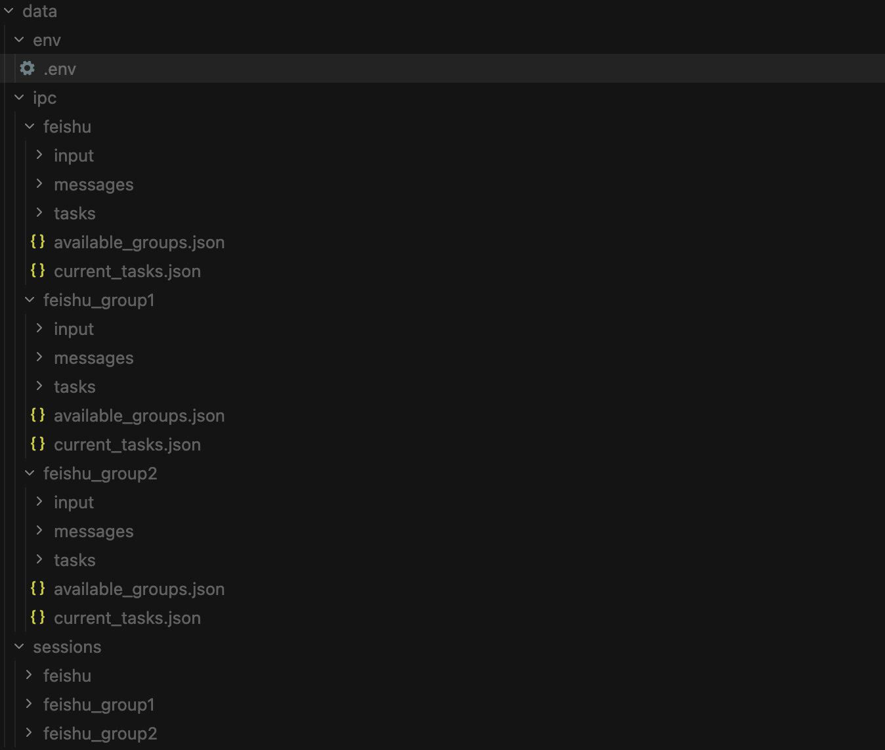
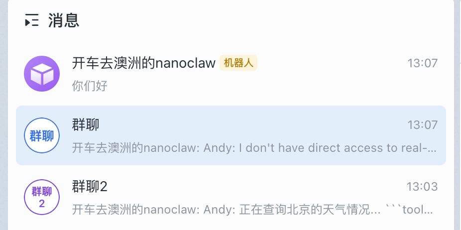
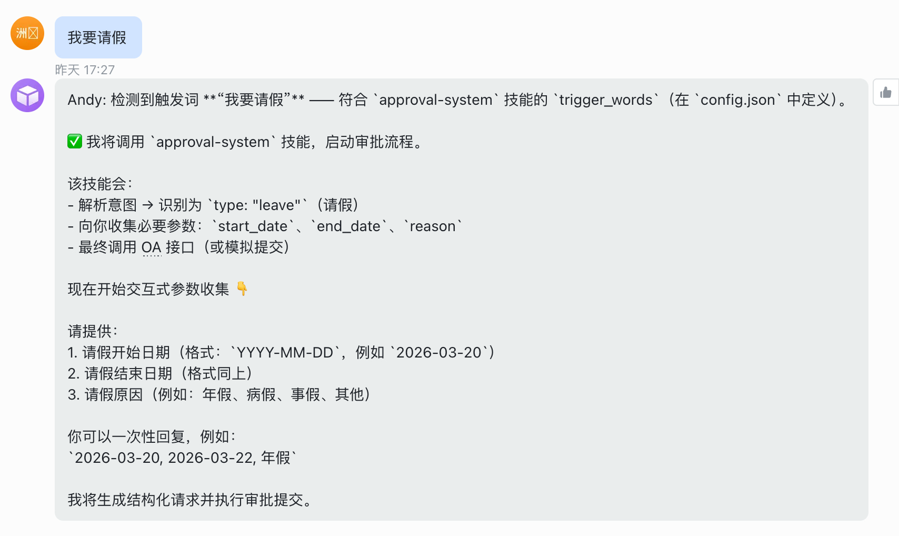
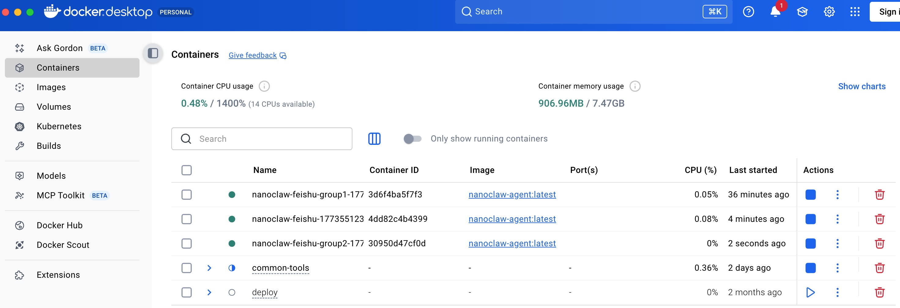

# NanoClaw 企业内智能体基座 — 可行性分析报告

**结论概要**：NanoClaw 作为企业内智能体基座**可行**；基座能力已部分验证
（国产模型、飞书、审批 Skill），意图识别与权限需在 Skill/网关层增强，并需关注运维与成本。

| 维度 | 已经验证 | 需增强/定制部分 | 实现方案与建议 |
|------|----------|-----------------|----------------|
| **基座与渠道** | Docker 安装与镜像构建；飞书 add-feishu + WebSocket 长连接；消息经 SQLite 轮询、按群组调度容器；自建 Channel 按 SPEC 实现接口并注册即可。 | 无（飞书已验证）。 | 继续使用飞书自研web聊天 Channel。 |
| **对话意图识别** | 大模型自然语言理解；Skill 内 triggers（如「请假」「报销」）识别审批意图。 | 缺乏结构化、可配置的意图模块；企业领域术语与流程需适配。 | 关键业务沿用 Skill 内 triggers + 参数 schema；可选将 NLU 封装为 Skill 内工具，模型调用工具获结构化意图后再执行业务。 |
| **工作流/审批** | 针对审批流的Skill：触发词识别 → 参数收集 → Python 脚本提交（可接 OA）；「我要请假」闭环已在飞书群验证。 | 无 | 按审批类型扩展 config.json 与脚本；对接真实 OA 接口与 webhook 回写；敏感操作前二次确认。 |
| **权限与安全** | 容器隔离、凭证代理（Key 不落容器）、挂载白名单、群组/会话隔离、IPC 权限（[IPC_PERMISSIONS_ZH.md](../IPC_PERMISSIONS_ZH.md)）。 | 无用户级/角色级细粒度权限（RBAC/ABAC）；企业群组/成员同步未验证。 | 优先在 Skill 内集成企业 IAM（LDAP/AD 或统一身份 API），调用前校验身份与权限；可选扩展 db 存用户-角色-权限；在 ipc/MCP 层打审计日志。 |
| **运维与成本** | 单 SQLite + 按群目录/会话隔离，数据落 host；多群组有限并行、单群组串行；容器空闲超时关闭。 | 无原生 Token 计量；单进程/单库需考虑高可用与备份。 | 在模型调用链（Host 代理或网关）注入 Token 统计并上报监控；按部门/项目分摊与配额告警；多实例 + 负载均衡与持久化备份。 |

### 多用户（多群组）启动 Pod 的优缺点与注意事项

NanoClaw 采用「每群组一个容器」模型：不同群组/用户可同时各占一个 Pod（容器），由 GroupQueue 管理并发与排队。

| 维度 | 说明 |
|------|------|
| **优点** | **隔离**：群组间进程、文件系统、会话互不干扰，满足安全与多租户诉求。<br>**并行**：多群组可同时各有活跃容器，响应互不阻塞。<br>**会话保持**：同一群组在空闲超时内复用同一容器，无需每次冷启动。<br>**资源可控**：通过 `MAX_CONCURRENT_CONTAINERS` 限制同时运行的 Pod 数量，避免宿主机过载。 |
| **缺点** | **资源占用**：每个 Pod 独立占用内存与 CPU，多用户同时在线时总资源线性增长。<br>**排队延迟**：并发达上限后，新有消息的群组需等已有容器退出才能起新 Pod，首条回复会有冷启动延迟。<br>**冷启动**：新起容器需拉镜像、挂载、启动 Agent，首轮响应较慢。 |
| **注意事项** | **并发上限**：在 `.env` 中合理设置 `MAX_CONCURRENT_CONTAINERS`（默认 5），按宿主机资源与预期并发调整。<br>**空闲超时**：`IDLE_TIMEOUT`（默认 30 分钟）决定无新消息时 Pod 保留时长；过长占资源，过短增加冷启动频率。<br>**群组注册**：仅已写入 `registered_groups` 的群组会触发 Pod；企业场景需与组织架构/权限同步，避免误注册或遗漏。<br>**监控与限流**：建议监控同时运行容器数、排队长度与冷启动次数，必要时配合网关或渠道侧限流，防止突发流量打满并发。 |

---

## 一、概述与需求对齐

### 1.1 企业内智能应用核心要求

- **安全可控**：数据与执行隔离、凭证不落盘、权限可审计、行为可追溯。

### 1.2 目标场景

| 场景 | 说明 |
|------|------|
| 1 对 1 数字助理 | 个人专属助理，私密对话与个性化记忆 |
| 审批流程事务助理 | 针对请假、报销、采购等审批的事务性处理与 OA 对接 |
| 项目小组型助理 | 以项目为单位的群组助理，组内共享、组间隔离 |

### 1.3 需求与 NanoClaw 能力对应

（扩展自 [VERIFIED_IMPLEMENTATION_PLAN.md](VERIFIED_IMPLEMENTATION_PLAN.md) 第二节。）

| 需求项 | 本报告结论 | 说明 |
|--------|------------|------|
| 安全可控 | 满足，已验证 | 容器隔离、凭证代理、挂载白名单、群组/会话隔离（见 [SPEC](SPEC.md)、[SECURITY](SECURITY.md)）。 |
| 渠道（飞书/自建） | 满足，飞书已验证 | 飞书通过 add-feishu 打通；自建或其它 Channel 按 [SPEC 的 Channel 系统](../SPEC.md) 实现 `Channel` 接口并注册即可。 |
| 对话意图识别 | 可行，可增强 | 当前为「触发词 + 大模型理解」；增强方案见第三节。 |
| 对接内部工作流/审批 | 满足，已验证 | 通过 Skill（如 approval-system）定义触发词、参数与脚本/接口，已验证「我要请假」闭环。 |
| 权限控制 | 安全为必须，可行 | 容器级与群组级隔离已具备；用户/角色级需在 Skill 内集成 IAM（见 [ENTERPRISE_EXTENSION_REFINEMENTS.md](ENTERPRISE_EXTENSION_REFINEMENTS.md) §2）。 |

### 1.4 数据落盘与隔离（含 data/ 目录说明）

**数据保存在 Host 磁盘、各群与 1v1 隔离**：所有持久化数据（消息库、会话、群组目录、IPC）均落在宿主机（Host）磁盘，不依赖容器内部存储；容器销毁后数据仍在。**各群组与 1v1 会话**通过「每群组独立目录 + 独立会话目录」实现隔离：每个群组（含 1v1 私聊对应的群组）拥有自己的 `groups/{channel}_{name}/` 与 `data/sessions/{group_folder}/`，群组间无法互访。**长期记忆与长上下文**也可沿用该方式存储：群组级记忆写在对应群目录下的 `CLAUDE.md` 或 Agent 生成文件中，会话与对话历史在 `data/sessions/{group}/.claude/` 下以 JSONL 等形式保存，既满足安全可控（数据在 host、按群隔离），又便于备份与审计。

**`data/` 目录结构**（项目根下 `data/`，gitignored，均为应用运行时状态）：

```
data/
├── env/
│   └── env                 # 供容器挂载的 .env 副本（仅含认证等必要变量，由 cp .env data/env/env 同步）
├── sessions/               # 按群组隔离的会话与长期上下文
│   └── {group_folder}/     # 如 feishu_main、feishu_group1，1v1 对应单独 folder
│       └── .claude/        # 挂载到容器内 /home/node/.claude/
│           ├── projects/   # 会话项目与 JSONL 对话记录（长上下文）
│           ├── skills/     # 该群同步的 skills（从 container/skills/ 拷贝）
│           ├── settings.json
│           ├── backups/     # 会话备份
│           └── debug/       # 调试输出
└── ipc/                    # Host 与容器间进程间通信，按群组隔离
    └── {group_folder}/     # 每个群组独立 IPC 目录，挂载到容器 /workspace/ipc
        ├── input/          # Host → 容器：新消息与 _close 标记
        ├── messages/       # 容器 → Host：发消息请求
        └── tasks/          # 容器 → Host：定时任务等请求
```

| 路径 | 说明 |
|------|------|
| `data/env/env` | 容器内可见的环境变量文件（仅认证等），由 Host 从 `.env` 筛选后同步，容器内无完整 .env。 |
| `data/sessions/{group}/.claude/` | 该群组专属的会话与配置：对话记录（JSONL）、skills 副本、设置；长期记忆与长上下文即存于此，群组间物理隔离。 |
| `data/ipc/{group}/` | 该群组专属的 IPC 目录；Host 根据目录名识别请求来源群组，用于权限与审计。 |

  
*图：data/ 持久化路径与按群组/1v1 隔离示意（env、ipc、sessions 均落 host 磁盘，各群独立目录保证安全可靠与长期记忆存储）。*

---

## 二、技术架构与安全模型

### 2.1 架构概览

NanoClaw 采用 **Host 单进程 + 按群组容器** 的架构：

- **Host（Node.js）**：渠道连接、消息写入/轮询 SQLite、群组队列、计划任务、IPC、凭证代理；不运行大模型推理。
- **容器（按群组）**：每个群组会话在独立容器中运行 Claude Agent SDK，通过 stdin/stdout 与 Host 通信；模型请求经 Host 凭证代理转发至真实端点（或国产模型网关）。

架构图见 [SPEC — Architecture](../SPEC.md#architecture) 与 [SPEC — Channel System](../SPEC.md#architecture-channel-system)。

```
┌──────────────────────────────────────────────────────────────────────┐
│                        HOST (macOS / Linux)                           │
│  Channels ↔ SQLite ↔ Message Loop / Scheduler / IPC Watcher         │
│                       │ spawns container                              │
├───────────────────────┼──────────────────────────────────────────────┤
│                     CONTAINER (Linux VM)                               │
│  AGENT RUNNER: /workspace/group, tools, MCP(nanoclaw)                 │
└───────────────────────────────────────────────────────────────────────┘
```

### 2.2 安全边界（引用 [SECURITY.md](../SECURITY.md)）

| 边界 | 说明 |
|------|------|
| **容器隔离（主边界）** | 进程、文件系统、网络与主机隔离；仅显式挂载目录可见；非 root 运行。 |
| **挂载白名单** | `~/.config/nanoclaw/mount-allowlist.json` 存于 host、**不挂入容器**，Agent 无法篡改。 |
| **凭证隔离** | 真实 API Key 不进入容器；Host 凭证代理在转发时注入认证头。 |
| **会话隔离** | 每群组独立 `data/sessions/{group}/.claude/`，群组间无法互访会话与记忆。 |
| **IPC 权限** | 主群可管理所有群组与任务、向任意会话发消息；非主群仅能操作本群。 |

### 2.3 数据与记忆

- **单 SQLite**：`store/messages.db`，通过 `chat_jid` / `group_folder` 区分群组，**非**每群独立库。
- **按群目录**：`groups/{channel}_{name}/`（CLAUDE.md、日志、Agent 生成文件）、`data/sessions/{group_folder}/`（会话数据）。
- **数据落 host**：上述目录与 store 均在 host，Docker 挂载进容器，重启不丢数据。（与 [ENTERPRISE_EXTENSION_REFINEMENTS.md](ENTERPRISE_EXTENSION_REFINEMENTS.md) §1 表述一致。）

---

## 三、四大需求点的可行性分析

| 需求点 | 可行性结论 | 依据与实现方式 |
|--------|------------|----------------|
| **基座 + Channel** | 可行，已验证 | NanoClaw 作内核；飞书已通过 add-feishu 打通；自建或其它 Channel 按 SPEC 实现 `Channel` 接口并注册。 |
| **1v1/群聊中的对话意图识别** | 可行，可增强 | **当前**：消息经 Host 路由进容器，由 Agent + Skill 内 triggers（如 [approval-system/config.json](../../container/skills/approval-system/config.json)）做意图识别。**增强**：将 NLU 封装为 **Skill 内工具**，模型调用工具获结构化意图再执行业务（[ENTERPRISE_EXTENSION_REFINEMENTS.md](ENTERPRISE_EXTENSION_REFINEMENTS.md) §3 方式 A）；若需「请求前注入意图」则需扩展 Host/Runner 接口（未验证）。 |
| **对接内部工作流/审批** | 可行，已验证 | 通过 **Skill** 定义技能、触发词、参数与调用接口/脚本；[VERIFIED_IMPLEMENTATION_PLAN.md](VERIFIED_IMPLEMENTATION_PLAN.md) 5.8 已描述「我要请假」的触发词识别 → 参数收集 → Python 脚本提交（可接真实 OA）。 |
| **权限控制** | 安全为必须，可行 | 优先在 **Skill 内集成企业 IAM**（LDAP/AD 或统一身份 API），在每次工具调用前校验用户身份与权限；可选后续扩展 `src/db.ts` 存用户-角色-权限（[ENTERPRISE_EXTENSION_REFINEMENTS.md](ENTERPRISE_EXTENSION_REFINEMENTS.md) §2）。审计：在 `src/ipc.ts` 或 MCP 调用链打日志。 |

---

## 四、初始验证与测试信息

以下均为本仓库**已验证**的路径，可作为可行性报告的实证依据。

### 4.1 环境与部署

- **依赖**：Node.js 20+、Docker 已安装并运行。
- **一键脚本（可选）**：`./scripts/install-docker.sh` 完成依赖检查、`npm install`、`./container/build.sh`、容器自测、`npm run build`。
- **手动**：`npm install` → `./container/build.sh` → `npm run build`。

详见 [VERIFIED_IMPLEMENTATION_PLAN.md](VERIFIED_IMPLEMENTATION_PLAN.md) 第五节与 [INSTALL_DOCKER_ZH.md](../INSTALL_DOCKER_ZH.md)。

### 4.2 国产模型（通义）

- **DashScope 网关**（`dashscope_gateway/`）：端口 8005，接收 Anthropic 格式请求，转通义接口后回写 Anthropic 格式。
- **NanoClaw .env**：`ANTHROPIC_BASE_URL=http://host.docker.internal:8005`、`ANTHROPIC_API_KEY=<DashScope API Key>`；请求经 Host 代理转发，容器内无真实 Key。
- **同步**：`mkdir -p data/env && cp .env data/env/env`。

### 4.3 飞书渠道

- **接入方式**：add-feishu Skill（`npx tsx scripts/apply-skill.ts .claude/skills/add-feishu` 或 Claude Code `/add-feishu`）。
- **飞书侧**：开放平台创建应用，启用 WebSocket 长连接、事件 `im.message.receive_v1`，配置权限（如 `im:message`、`im:message:send_as_bot`）。
- **消息流**：飞书 → 渠道写入 SQLite → Host 轮询 → 按群组调度容器 → Agent 回复经渠道发回飞书。

  

### 4.4 审批流程（我要请假）

- **触发**：用户在飞书群发送「我要请假」等语句。
- **识别**：助手根据 `container/skills/approval-system/config.json` 的 `triggers`（请假、报销、审批等）识别为审批场景，类型 `leave`。
- **参数收集**：按 `approval_types.leave` 的 `params`/`required` 交互式收集 start_date、end_date、reason 等。
- **提交**：收集完成后通过 Bash 调用容器内 `index.py` 提交（未配置 OA 时为模拟；配置 OA 后对接真实接口）。

  

### 4.5 并发与容器生命周期

- **多群组**：有限并行，由 `MAX_CONCURRENT_CONTAINERS` 控制（默认 5）。
- **单群组**：串行，同一群组同一时刻仅一个容器，消息按序经 stdin 喂入。
- **容器关闭**：空闲 `IDLE_TIMEOUT`（默认 30 分钟）无新消息/无新结果后，Host 写 `_close`，容器主动退出；另有硬超时防止卡死。（[VERIFIED_IMPLEMENTATION_PLAN.md](VERIFIED_IMPLEMENTATION_PLAN.md) 4.7、4.8。）
  

---

## 五、风险与应对

| 风险 | 描述 | 应对 |
|------|------|------|
| **提示词注入/恶意输入** | 渠道消息可能含恶意指令，企图操纵 Agent。 | 仅处理已注册群组、触发词校验、容器隔离限制影响范围；仅注册可信群组、定期审查日志（[SPEC Security Considerations](../SPEC.md#security-considerations)）。 |
| **权限与审计缺口** | 当前无内置 RBAC/ABAC。 | 在 Skill 内集成 IAM；在 ipc/MCP 层打审计日志；敏感操作前二次确认。 |
| **意图识别一致性** | 纯模型理解可能不稳定。 | 关键业务（如审批）使用 Skill 内明确 triggers + 参数 schema（如 approval-system）；可选 NLU 工具增强。 |
| **单点与运维** | 单 Node 进程、单 SQLite。 | 按部门/项目多实例 + 负载均衡；备份与持久化挂载；监控与告警（见第六节）。 |
| **Token 与成本不可见** | 无原生 Token 计量。 | 在模型调用链（Host 代理或网关）注入 Token 统计并上报监控（[ENTERPRISE_EXTENSION_REFINEMENTS.md](ENTERPRISE_EXTENSION_REFINEMENTS.md) §4）。 |

---

## 六、效能与成本（在安全前提下的其他问题）

- **效能**：多群组并行受 `MAX_CONCURRENT_CONTAINERS` 限制；单群组串行保证顺序与一致性。高并发时可水平扩展多 NanoClaw 实例。
- **成本**：LLM 调用成本由模型与用量决定；建议在网关或代理侧做 Token 计量与按部门/项目分摊，设置配额与告警。
- **运维成本**：需维护容器运行时、Host 进程、SQLite 备份、日志与监控；可纳入现有 DevOps/K8s 体系。
- **国产化与合规**：通义等国产模型经网关接入已验证；敏感数据与日志需满足企业合规（存储位置、访问控制、审计留存）。

---

## 七、分阶段实施建议

（与 [ENTERPRISE_FEASIBLE_PLAN.md](ENTERPRISE_FEASIBLE_PLAN.md) 一致。）

| 阶段 | 内容 |
|------|------|
| **阶段一** | 最小可用内核：环境 + 国产模型 + 飞书 + 基础对话 + 容器隔离。—— 已具备验证路径。 |
| **阶段二** | 优先审批流程助理：一个高质量 Skill 打通「对话 → 意图/参数 → OA → 状态回写」并加审计。 |
| **阶段三** | 将 Skill 与权限/审计模式复用到 1 对 1 助理、项目小组助理；视需增强记忆（如向量检索）与 Token 监控。 |

---

## 八、总结与结论

- **可行性结论**：NanoClaw 作为企业内智能体基座**可行**。安全边界清晰（容器、凭证、挂载、会话），飞书与国产模型已验证，审批类 Skill 已跑通。
- **必须保障**：权限控制在 Skill 层集成 IAM + 审计日志；敏感操作可二次确认。
- **建议**：先落地阶段一与阶段二，用审批场景验证闭环，再复制到 1v1 与项目小组，并补足 Token 与运维可观测性。

---

## 参考文献与图片来源

- [SPEC.md](../SPEC.md) — 架构、Channel、配置、安全
- [VERIFIED_IMPLEMENTATION_PLAN.md](VERIFIED_IMPLEMENTATION_PLAN.md) — 已验证能力与操作步骤
- [ENTERPRISE_EXTENSION_REFINEMENTS.md](ENTERPRISE_EXTENSION_REFINEMENTS.md) — 记忆/权限/意图/Token 表述修正
- [ENTERPRISE_FEASIBLE_PLAN.md](ENTERPRISE_FEASIBLE_PLAN.md) — 分阶段可行方案
- [SECURITY.md](../SECURITY.md) — 安全模型与边界

